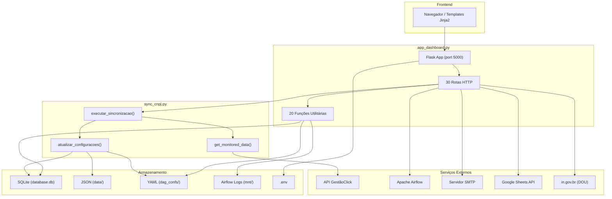
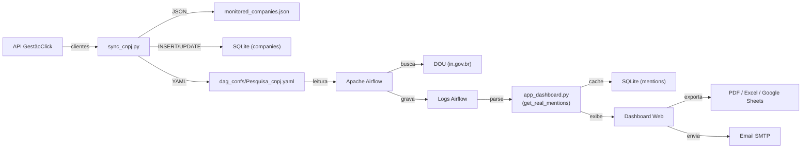

# Documentação Técnica — `app_dashboard.py` & `sync_cnpj.py`

> **Projeto:** Ro-DOU Registrale  
> **Gerado em:** 29/07/2026  
> **Escopo:** Documentação completa de todas as funções, rotas e mecanismos dos dois módulos.

---

## Sumário

1. [Visão Geral da Arquitetura](#1-visão-geral-da-arquitetura)
2. [Diagrama de Fluxo de Dados](#2-diagrama-de-fluxo-de-dados)
3. [`app_dashboard.py` — Funções Utilitárias](#3-app_dashboardpy--funções-utilitárias)
4. [`app_dashboard.py` — Rotas HTTP (Flask)](#4-app_dashboardpy--rotas-http-flask)
5. [`sync_cnpj.py` — Funções](#5-sync_cnpjpy--funções)
6. [`sync_cnpj.py` — DAG Airflow](#6-sync_cnpjpy--dag-airflow)

---

## 1. Visão Geral da Arquitetura



### Descrição Geral

O **Ro-DOU Registrale** é um sistema de monitoramento do Diário Oficial da União (DOU) para empresas clientes. Ele é composto por:

- **`app_dashboard.py`**: Aplicação web Flask que serve como painel de controle. Gerencia empresas, menções, rotinas de busca, configurações, templates de email, e exportações. Interage com SQLite, arquivos YAML/JSON, Airflow e serviços externos (SMTP, Google Sheets).

- **`sync_cnpj.py`**: Módulo de sincronização que busca dados de clientes na API GestãoClick, persiste em JSON/SQLite, e reconstrói os arquivos YAML consumidos pelo Airflow para busca no DOU.

---

## 2. Diagrama de Fluxo de Dados



---

## 3. `app_dashboard.py` — Funções Utilitárias

### 3.1 `set_sqlite_pragma`

| Item | Detalhe |
|------|---------|
| **Arquivo** | [app_dashboard.py#L61-L67](file:///C:/Users/Pedro/documents/projetos/teste_implantação/teste/ro-dou-registrale/app_dashboard.py#L61-L67) |
| **Assinatura** | `set_sqlite_pragma(dbapi_connection, connection_record)` |
| **Tipo** | Event listener SQLAlchemy (`Engine.connect`) |

**Descrição:**  
Configura pragmas de performance e resiliência do SQLite em cada nova conexão do pool do SQLAlchemy.

**Pragmas aplicados:**
- `journal_mode=WAL` — Write-Ahead Logging para melhor concorrência de leitura/escrita
- `synchronous=NORMAL` — Reduz fsync para performance, mantendo segurança razoável
- `busy_timeout=30000` — Espera até 30s se o banco estiver bloqueado

**Parâmetros:**
- `dbapi_connection` — Conexão DBAPI bruta do SQLite
- `connection_record` — Metadados da conexão no pool

**Retorno:** Nenhum  
**Efeitos colaterais:** Altera configurações da conexão SQLite

---

### 3.2 `init_default_data`

| Item | Detalhe |
|------|---------|
| **Arquivo** | [app_dashboard.py#L73-L84](file:///C:/Users/Pedro/documents/projetos/teste_implantação/teste/ro-dou-registrale/app_dashboard.py#L73-L84) |
| **Assinatura** | `init_default_data()` |
| **Dependências** | `User`, `EmailTemplate`, `db`, `create_default_email_template()` |

**Descrição:**  
Executa na inicialização da aplicação. Garante que o banco tenha:
1. Todas as tabelas criadas (`db.create_all()`)
2. Um usuário `admin` com role `master` e senha `admin`
3. Um template de email chamado `Padrão Registrale`

**Fluxo interno:**
1. Abre um `app_context`
2. Cria as tabelas se não existirem
3. Verifica se existe usuário `admin` — se não, cria com `set_password('admin')`
4. Verifica se existe template `Padrão Registrale` — se não, chama `create_default_email_template()`

**Retorno:** Nenhum  
**Efeitos colaterais:** Cria registros no SQLite (users, email_templates)

---

### 3.3 `add_header`

| Item | Detalhe |
|------|---------|
| **Arquivo** | [app_dashboard.py#L100-L106](file:///C:/Users/Pedro/documents/projetos/teste_implantação/teste/ro-dou-registrale/app_dashboard.py#L100-L106) |
| **Assinatura** | `add_header(response)` |
| **Tipo** | Decorator `@app.after_request` |

**Descrição:**  
Hook executado após **toda** resposta HTTP. Adiciona headers anti-cache para evitar que páginas autenticadas apareçam no histórico do navegador após logout.

**Headers adicionados:**
- `Cache-Control: no-store, no-cache, must-revalidate, max-age=0`
- `Pragma: no-cache`
- `Expires: 0`

**Parâmetros:**
- `response` — Objeto Flask `Response`

**Retorno:** O mesmo objeto `response` com headers modificados

---

### 3.4 `load_json`

| Item | Detalhe |
|------|---------|
| **Arquivo** | [app_dashboard.py#L108-L116](file:///C:/Users/Pedro/documents/projetos/teste_implantação/teste/ro-dou-registrale/app_dashboard.py#L108-L116) |
| **Assinatura** | `load_json(file_path, default=[])` |

**Descrição:**  
Carrega e deserializa um arquivo JSON. Retorna o valor `default` se o arquivo não existir ou houver erro.

**Parâmetros:**
- `file_path` (`str`) — Caminho absoluto do arquivo JSON
- `default` (`any`, opcional) — Valor padrão se falhar. Default: `[]`

**Retorno:** Dados deserializados do JSON ou o valor `default`  
**Tratamento de erros:** Log de erro via `logger.error`, retorna `default`

> [!WARNING]
> O parâmetro `default=[]` usa um objeto mutável como argumento padrão. Isto pode causar efeitos colaterais se o retorno for modificado in-place entre chamadas.

---

### 3.5 `save_json`

| Item | Detalhe |
|------|---------|
| **Arquivo** | [app_dashboard.py#L118-L129](file:///C:/Users/Pedro/documents/projetos/teste_implantação/teste/ro-dou-registrale/app_dashboard.py#L118-L129) |
| **Assinatura** | `save_json(file_path, data)` |

**Descrição:**  
Serializa dados para JSON e salva em disco com garantia de persistência (`fsync`).

**Fluxo interno:**
1. Cria diretórios pai com `os.makedirs` se necessário
2. Abre o arquivo com encoding UTF-8
3. Serializa com `indent=4` e `ensure_ascii=False` (preserva acentos)
4. Chama `f.flush()` seguido de `os.fsync(f.fileno())` para forçar escrita em disco

**Parâmetros:**
- `file_path` (`str`) — Caminho do arquivo de saída
- `data` (`any`) — Dados serializáveis em JSON

**Retorno:** `True` em sucesso, `False` em falha  
**Efeitos colaterais:** Cria/sobrescreve arquivo em disco

---

### 3.6 `add_history_event`

| Item | Detalhe |
|------|---------|
| **Arquivo** | [app_dashboard.py#L131-L148](file:///C:/Users/Pedro/documents/projetos/teste_implantação/teste/ro-dou-registrale/app_dashboard.py#L131-L148) |
| **Assinatura** | `add_history_event(evento, detalhes)` |
| **Dependências** | `SyncHistory`, `db` |

**Descrição:**  
Registra um evento no histórico de sincronização do sistema, mantendo no máximo **50 registros** (FIFO).

**Fluxo interno:**
1. Cria um `SyncHistory` com data formatada no fuso BRT (`-3h`)
2. Se existirem ≥ 50 registros, remove o mais antigo
3. Faz commit no SQLite

**Parâmetros:**
- `evento` (`str`) — Tipo do evento (ex: `"Sincronização OK"`, `"Erro Sync"`)
- `detalhes` (`str`) — Descrição livre do evento

**Retorno:** Nenhum  
**Efeitos colaterais:** INSERT/DELETE no SQLite, tabela `sync_history`

---

### 3.7 `normalize_cnpj`

| Item | Detalhe |
|------|---------|
| **Arquivo** | [app_dashboard.py#L150-L152](file:///C:/Users/Pedro/documents/projetos/teste_implantação/teste/ro-dou-registrale/app_dashboard.py#L150-L152) |
| **Assinatura** | `normalize_cnpj(cnpj)` |

**Descrição:**  
Remove todos os caracteres não alfanuméricos de um CNPJ e converte para maiúsculas. Usado em todo o sistema para comparação uniforme de CNPJs.

**Parâmetros:**
- `cnpj` (`str | None`) — CNPJ em qualquer formato

**Retorno:** `str` — CNPJ limpo (ex: `"12345678000190"`) ou `""` se vazio

---

### 3.8 `get_monitored_cnpjs`

| Item | Detalhe |
|------|---------|
| **Arquivo** | [app_dashboard.py#L154-L175](file:///C:/Users/Pedro/documents/projetos/teste_implantação/teste/ro-dou-registrale/app_dashboard.py#L154-L175) |
| **Assinatura** | `get_monitored_cnpjs()` |

**Descrição:**  
Retorna o conjunto de CNPJs atualmente sendo monitorados no DOU, extraídos diretamente dos arquivos YAML de configuração do Airflow.

**Fluxo interno:**
1. Busca `Pesquisa_cnpj.yaml` em `dag_confs/`
2. Se não encontrar, tenta padrão `Pesquisa_cnpj_part_*.yaml`
3. Lê a chave `dag.search[].terms` de cada arquivo
4. Normaliza cada termo com `normalize_cnpj()` e adiciona a um `set`

**Retorno:** `set[str]` — Conjunto de CNPJs normalizados  
**Dependências de disco:** Leitura de `dag_confs/Pesquisa_cnpj*.yaml`

---

### 3.9 `get_companies_data`

| Item | Detalhe |
|------|---------|
| **Arquivo** | [app_dashboard.py#L177-L199](file:///C:/Users/Pedro/documents/projetos/teste_implantação/teste/ro-dou-registrale/app_dashboard.py#L177-L199) |
| **Assinatura** | `get_companies_data()` |
| **Dependências** | `Company` (model), `get_monitored_cnpjs()` |

**Descrição:**  
Monta a lista completa de empresas cadastradas, incluindo o status de monitoramento em tempo real (cruzando dados do DB com os YAMLs).

**Fluxo interno:**
1. Obtém CNPJs ativos via `get_monitored_cnpjs()`
2. Consulta todas as empresas no SQLite (`Company.query.all()`)
3. Para cada empresa, verifica se seu CNPJ normalizado está no set de ativos
4. Monta dicionário com campos: `id`, `nome`, `cnpj`, `uf`, `cidade`, `email`, `telefone`, `situacao`, `status`, `origem`
5. Ordena por nome

**Retorno:** `list[dict]` — Lista de empresas ordenada por nome

---

### 3.10 `sync_json_to_db`

| Item | Detalhe |
|------|---------|
| **Arquivo** | [app_dashboard.py#L201-L247](file:///C:/Users/Pedro/documents/projetos/teste_implantação/teste/ro-dou-registrale/app_dashboard.py#L201-L247) |
| **Assinatura** | `sync_json_to_db()` |
| **Dependências** | `Company` (model), `METADATA_FILE` |

**Descrição:**  
Importa empresas do arquivo legado `monitored_companies.json` para o SQLite. Faz upsert respeitando a regra: **empresas com `origem='Manual'` nunca são sobrescritas**.

**Fluxo interno:**
1. Lê `monitored_companies.json`
2. Para cada empresa no JSON:
   - Se não existe no DB (por `cnpj_norm`): INSERT com `origem='GestaoClick'`
   - Se existe e `origem != 'Manual'`: UPDATE dos campos
   - Se existe e `origem == 'Manual'`: SKIP (preserva edição manual)
3. Commit único ao final

**Retorno:** Nenhum  
**Efeitos colaterais:** INSERT/UPDATE no SQLite, tabela `companies`  
**Log:** Registra contadores de novas e atualizadas

---

### 3.11 `get_real_mentions`

| Item | Detalhe |
|------|---------|
| **Arquivo** | [app_dashboard.py#L249-L387](file:///C:/Users/Pedro/documents/projetos/teste_implantação/teste/ro-dou-registrale/app_dashboard.py#L249-L387) |
| **Assinatura** | `get_real_mentions()` |
| **Dependências** | `Mention`, `Company`, `Settings` (models), `EmailSender`, `hashlib`, `uuid` |

**Descrição:**  
Função central do sistema de detecção de menções. Varre os logs do Airflow, extrai publicações do DOU que mencionam CNPJs monitorados, e mantém um cache persistente no SQLite.

**Fluxo interno detalhado:**

1. **Verificação de cache:**
   - Compara `last_parsed_at` (armazenado em `Settings`) com o `mtime` mais recente dos logs
   - Se cache é atual → retorna menções do DB diretamente

2. **Parse de logs:**
   - Localiza arquivos de log com padrão: `dag_id=*/run_id=*/task_id=exec_searchs.exec_search_*/attempt=*.log`
   - Usa regex para extrair o valor de retorno das tasks: `\[(.*?)\].*?Done\. Returned value was: (\{.*?\})$`
   - Avalia o dicionário com `ast.literal_eval`

3. **Extração de menções:**
   - Navega a estrutura `result → single_group → {cnpj} → {departamento} → [publicações]`
   - Para cada publicação, gera um ID único (MD5 de `cnpj + date + abstract`)
   - Remove tags HTML do abstract
   - Formata o trecho usando `EmailSender.format_abstract()` (com fallback)
   - Resolve o nome da empresa via `cnpj_map` ou consulta ao DB

4. **Deduplicação:**
   - Usa chave `{cnpj_norm}_{pub_id}` para manter apenas a detecção mais recente

5. **Ordenação:**
   - Por data da publicação (desc) e timestamp de detecção (desc)

6. **Persistência do cache:**
   - Limpa a tabela `Mention` e re-insere todas (com novos UUIDs)
   - Atualiza `last_parsed_at` em `Settings`

**Retorno:** `list[dict]` — Lista de menções com campos: `id`, `empresa`, `cnpj`, `cnpj_norm`, `secao`, `data`, `detected_at`, `trecho`, `link`

**Efeitos colaterais:** DELETE + INSERT em massa nas tabelas `mentions` e `settings`

> [!IMPORTANT]
> Esta é a função mais complexa e crítica do sistema. Faz parse pesado de logs, acesso a DB, e reconstrução completa do cache a cada invocação quando o cache está desatualizado.

---

### 3.12 `login_required`

| Item | Detalhe |
|------|---------|
| **Arquivo** | [app_dashboard.py#L389-L395](file:///C:/Users/Pedro/documents/projetos/teste_implantação/teste/ro-dou-registrale/app_dashboard.py#L389-L395) |
| **Assinatura** | `login_required(f)` |

**Descrição:**  
Decorator personalizado de autenticação. Verifica se existe `session['user']`; se não, redireciona para `/login`.

**Parâmetros:**
- `f` (`callable`) — Função de view a ser protegida

**Retorno:** Função decorada que exige sessão ativa  
**Nota:** Usa `functools.wraps` para preservar metadados da função original

---

### 3.13 `get_last_search_time`

| Item | Detalhe |
|------|---------|
| **Arquivo** | [app_dashboard.py#L446-L454](file:///C:/Users/Pedro/documents/projetos/teste_implantação/teste/ro-dou-registrale/app_dashboard.py#L446-L454) |
| **Assinatura** | `get_last_search_time()` |

**Descrição:**  
Retorna o horário da última busca executada, baseado no `mtime` do log mais recente do Airflow.

**Fluxo interno:**
1. Busca logs com padrão `dag_id=pesquisa_cnpj*/run_id=*/task_id=exec_searchs.exec_search_*/attempt=*.log`
2. Seleciona o arquivo com maior `mtime`
3. Formata no fuso BRT (`-3h`) como `dd/mm HH:MM`

**Retorno:** `str` — Data/hora formatada ou `"N/A"` se não houver logs

---

### 3.14 `get_next_search_time`

| Item | Detalhe |
|------|---------|
| **Arquivo** | [app_dashboard.py#L456-L479](file:///C:/Users/Pedro/documents/projetos/teste_implantação/teste/ro-dou-registrale/app_dashboard.py#L456-L479) |
| **Assinatura** | `get_next_search_time()` |

**Descrição:**  
Calcula a próxima execução agendada da busca, baseando-se na expressão cron configurada no YAML.

**Fluxo interno:**
1. Lê o schedule do `Pesquisa_cnpj.yaml` (ex: `"0 8 * * *"`)
2. Extrai hora e minuto do cron
3. Calcula a próxima ocorrência a partir de `now`
4. Se o horário já passou hoje, avança para amanhã
5. Pula finais de semana (MON-FRI apenas)

**Retorno:** `str` — Data/hora formatada `dd/mm HH:MM`

---

### 3.15 `rebuild_yaml_from_db`

| Item | Detalhe |
|------|---------|
| **Arquivo** | [app_dashboard.py#L651-L699](file:///C:/Users/Pedro/documents/projetos/teste_implantação/teste/ro-dou-registrale/app_dashboard.py#L651-L699) |
| **Assinatura** | `rebuild_yaml_from_db()` |
| **Dependências** | `Company` (model), `yaml`, `math`, `copy` |

**Descrição:**  
Reconstrói o arquivo YAML de busca do Airflow a partir dos dados atuais do SQLite. Chamada automaticamente após edições de empresas no dashboard.

**Fluxo interno:**
1. Consulta empresas ativas e monitoradas (`situacao='Ativa'`, `status=True`)
2. Coleta CNPJs únicos e ordenados
3. Lê o arquivo `Pesquisa_cnpj.yaml` existente como template
4. Divide CNPJs em chunks de **1500** (constante `CHUNK_SIZE`)
5. Para cada chunk, clona a seção `search` do template e substitui `terms`
6. Atribui header `"... - PARTE {N}"` a cada bloco
7. Escrita atômica: grava em `.tmp` e faz `os.replace()` para o destino final

**Retorno:** Nenhum  
**Efeitos colaterais:** Sobrescreve `dag_confs/Pesquisa_cnpj.yaml`

> [!TIP]
> A escrita atômica via `os.replace()` evita que o Airflow leia um arquivo parcialmente escrito.

---

### 3.16 `get_routines`

| Item | Detalhe |
|------|---------|
| **Arquivo** | [app_dashboard.py#L709-L831](file:///C:/Users/Pedro/documents/projetos/teste_implantação/teste/ro-dou-registrale/app_dashboard.py#L709-L831) |
| **Assinatura** | `get_routines()` |

**Descrição:**  
Lista todas as rotinas de busca configuradas no sistema, consolidando arquivos YAML em `dag_confs/`.

**Fluxo interno:**
1. Varre todos os `*.yaml` em `dag_confs/`
2. Classifica cada arquivo:
   - `pesquisa_cnpj.yaml` → Rotina de sincronização (base)
   - `*_part_*` ou `*_sync*` → Partes da sincronização (ignoradas individualmente)
   - Outros → Rotinas customizadas
3. Para rotinas customizadas, extrai: `id`, `file`, `description`, `schedule`, `terms`, `organs`, `sections`, `emails`, `subject`, `source`
4. Consolida a rotina de sincronização num único registro, somando todos os termos de todas as partes
5. Insere a rotina de sync na posição 0 (primeira)

**Retorno:** `list[dict]` — Lista de rotinas (sync primeiro, depois customizadas)

**Campos por rotina:**
| Campo | Tipo | Descrição |
|-------|------|-----------|
| `id` | `str` | Identificador da rotina |
| `file` | `str` | Nome do arquivo YAML |
| `description` | `str` | Descrição da rotina |
| `schedule` | `str` | Expressão cron |
| `terms` | `list[str]` | Termos de busca |
| `organs` | `list[str]` | Órgãos/departamentos filtrados |
| `sections` | `list[str]` | Seções do DOU |
| `emails` | `list[str]` | Destinatários do relatório |
| `subject` | `str` | Assunto do email |
| `type` | `str` | `"sync"` ou `"custom"` |
| `is_exact_search` | `bool` | Busca exata |
| `force_rematch` | `bool` | Forçar reavaliação |
| `terms_ignore` | `list[str]` | Termos a ignorar |
| `source` | `str` | `"DOU"` ou `"INLABS"` |

---

### 3.17 `run_sync_in_background`

| Item | Detalhe |
|------|---------|
| **Arquivo** | [app_dashboard.py#L974-L991](file:///C:/Users/Pedro/documents/projetos/teste_implantação/teste/ro-dou-registrale/app_dashboard.py#L974-L991) |
| **Assinatura** | `run_sync_in_background()` |
| **Dependências** | `executar_sincronizacao` (de `sync_cnpj.py`), `sync_json_to_db()` |

**Descrição:**  
Função alvo da thread de sincronização. Orquestra o fluxo completo de atualização de dados da API GestãoClick.

**Fluxo interno:**
1. Chama `executar_sincronizacao()` (busca API + atualiza YAML/JSON)
2. Chama `sync_json_to_db()` (importa JSON → SQLite)
3. Registra evento de sucesso no histórico

**Tratamento de erros:**
- Em caso de exceção na sincronização, ainda tenta executar `sync_json_to_db()` para salvar dados parciais que já foram escritos no JSON
- Registra erro no histórico

**Retorno:** Nenhum  
**Efeitos colaterais:** Escrita em JSON, SQLite, YAML (via funções chamadas)

---

### 3.18 `trigger_sync_logic`

| Item | Detalhe |
|------|---------|
| **Arquivo** | [app_dashboard.py#L993-L1003](file:///C:/Users/Pedro/documents/projetos/teste_implantação/teste/ro-dou-registrale/app_dashboard.py#L993-L1003) |
| **Assinatura** | `trigger_sync_logic()` |

**Descrição:**  
Inicia a sincronização em uma thread daemon separada. É o ponto de entrada chamado pela rota `/api/sync`.

**Fluxo interno:**
1. Verifica se `executar_sincronizacao` foi importado com sucesso
2. Cria `threading.Thread(target=run_sync_in_background, daemon=True)`
3. Registra evento "Sincronização Iniciada" no histórico
4. Retorna resposta imediata ao cliente

**Retorno:** `flask.Response` — JSON com status `success` ou `error`

---

### 3.19 `trigger_airflow_dag`

| Item | Detalhe |
|------|---------|
| **Arquivo** | [app_dashboard.py#L1005-L1072](file:///C:/Users/Pedro/documents/projetos/teste_implantação/teste/ro-dou-registrale/app_dashboard.py#L1005-L1072) |
| **Assinatura** | `trigger_airflow_dag(dag_id, logical_date=None, skip_notifications=False, conf_override=None)` |
| **Dependências** | `requests`, `subprocess` |

**Descrição:**  
Dispara uma DAG no Apache Airflow. Tenta primeiro via API REST; se falhar, usa fallback via Docker CLI.

**Parâmetros:**
| Parâmetro | Tipo | Descrição |
|-----------|------|-----------|
| `dag_id` | `str` | ID da DAG a ser disparada |
| `logical_date` | `str`, opcional | Data lógica no formato `YYYY-MM-DD` |
| `skip_notifications` | `bool`, opcional | Se `True`, envia `skip_notifications=True` na conf |
| `conf_override` | `dict`, opcional | Parâmetros extras para a conf da DAG |

**Fluxo interno:**

1. **Tentativa via API REST:**
   - `PATCH /api/v1/dags/{dag_id}` → Despausar a DAG
   - `POST /api/v1/dags/{dag_id}/dagRuns` → Disparar com payload
   - Gera `dag_run_id` único com timestamp em milissegundos
   - Auth: `("airflow", "airflow")`
   - Timeout: 5s

2. **Fallback via Docker CLI (se API falhar):**
   - `docker compose exec -T airflow-scheduler airflow dags unpause {dag_id}`
   - `docker compose exec -T airflow-scheduler airflow dags trigger {dag_id} --conf {...}`
   - Timeout: 15s

**Retorno:** `tuple[bool, str]` — `(sucesso, mensagem)`

---

### 3.20 `create_default_email_template`

| Item | Detalhe |
|------|---------|
| **Arquivo** | [app_dashboard.py#L1979-L2002](file:///C:/Users/Pedro/documents/projetos/teste_implantação/teste/ro-dou-registrale/app_dashboard.py#L1979-L2002) |
| **Assinatura** | `create_default_email_template()` |
| **Dependências** | `EmailTemplate` (model) |

**Descrição:**  
Cria ou atualiza o template de email `Padrão Registrale` no banco, carregando o HTML de `src/notification/templates/dashboard_template.html`.

**Fluxo interno:**
1. Lê o conteúdo de `dashboard_template.html`
2. Se o template `Padrão Registrale` já existe no DB → atualiza subject e HTML
3. Se não existe → cria novo registro

**Retorno:** Nenhum  
**Efeitos colaterais:** INSERT/UPDATE no SQLite, tabela `email_templates`

---

## 4. `app_dashboard.py` — Rotas HTTP (Flask)

### 4.1 `POST /login` · `GET /login`

| Item | Detalhe |
|------|---------|
| **Arquivo** | [app_dashboard.py#L397-L410](file:///C:/Users/Pedro/documents/projetos/teste_implantação/teste/ro-dou-registrale/app_dashboard.py#L397-L410) |
| **Função** | `login()` |
| **Autenticação** | Nenhuma (ponto de entrada) |

**GET:** Renderiza `login.html`

**POST:**
1. Recebe `username` e `password` do form
2. Busca o usuário no DB (`User.query.filter_by`)
3. Valida senha com `user.check_password()`
4. Em sucesso:
   - Define `session['user']` com username e role
   - Define `session['expires_at']` (timestamp + session lifetime)
   - Redireciona para `/`
5. Em falha: Re-renderiza `login.html` com mensagem de erro

---

### 4.2 `GET /logout`

| Item | Detalhe |
|------|---------|
| **Arquivo** | [app_dashboard.py#L412-L415](file:///C:/Users/Pedro/documents/projetos/teste_implantação/teste/ro-dou-registrale/app_dashboard.py#L412-L415) |
| **Função** | `logout()` |

**Descrição:** Limpa toda a sessão e redireciona para `/login`.

---

### 4.3 `POST /api/extend_session`

| Item | Detalhe |
|------|---------|
| **Arquivo** | [app_dashboard.py#L417-L422](file:///C:/Users/Pedro/documents/projetos/teste_implantação/teste/ro-dou-registrale/app_dashboard.py#L417-L422) |
| **Função** | `extend_session()` |
| **Autenticação** | `@login_required` |

**Descrição:** Estende a sessão do usuário por mais **60 minutos**. Retorna `{"status": "ok", "time_left": 3600}`.

---

### 4.4 `GET /api/mentions`

| Item | Detalhe |
|------|---------|
| **Arquivo** | [app_dashboard.py#L424-L427](file:///C:/Users/Pedro/documents/projetos/teste_implantação/teste/ro-dou-registrale/app_dashboard.py#L424-L427) |
| **Função** | `api_mentions()` |
| **Autenticação** | `@login_required` |

**Descrição:** Retorna todas as menções detectadas como JSON. Delega para `get_real_mentions()`.

**Retorno:** `list[dict]` — Array JSON com todas as menções

---

### 4.5 `DELETE /api/mentions`

| Item | Detalhe |
|------|---------|
| **Arquivo** | [app_dashboard.py#L429-L444](file:///C:/Users/Pedro/documents/projetos/teste_implantação/teste/ro-dou-registrale/app_dashboard.py#L429-L444) |
| **Função** | `delete_mentions()` |
| **Autenticação** | `@login_required` |

**Body esperado:** `{"ids": ["uuid1", "uuid2", ...]}`

**Descrição:** Exclui menções específicas por seus IDs (UUIDs).

**Retorno:**
- `200` — `{"status": "success", "message": "N menções excluídas."}`
- `400` — Se `ids` não fornecido
- `500` — Se erro no DB (com rollback)

---

### 4.6 `GET /`

| Item | Detalhe |
|------|---------|
| **Arquivo** | [app_dashboard.py#L481-L546](file:///C:/Users/Pedro/documents/projetos/teste_implantação/teste/ro-dou-registrale/app_dashboard.py#L481-L546) |
| **Função** | `index()` |
| **Autenticação** | `@login_required` |

**Descrição:** Página principal do dashboard. Renderiza `index.html` com dados iniciais completos.

**Fluxo interno:**
1. Verifica expiração absoluta da sessão
2. Se o usuário é `master`, carrega settings e lista de usuários
3. Carrega histórico (últimos 50 eventos)
4. Obtém menções via `get_real_mentions()`
5. Lê dados de sincronização (última sync, última busca, próxima busca)
6. Calcula `time_left` da sessão para o frontend
7. Monta `init_data` com KPIs para Alpine.js:
   - Total de CNPJs cadastrados
   - CNPJs ativos monitorados
   - Menções de hoje
   - Menções do mês

**Variáveis passadas ao template:**
| Variável | Tipo | Descrição |
|----------|------|-----------|
| `user` | `dict` | Dados da sessão (`username`, `role`) |
| `init_data` | `dict` | KPIs e menções recentes (top 20) |
| `mencoes` | `list` | Top 20 menções |
| `last_sync` | `str` | Horário da última sincronização |
| `last_search` | `str` | Horário da última busca |
| `next_search` | `str` | Horário da próxima busca |
| `time_left` | `int` | Segundos restantes da sessão |
| `settings` | `dict` | Configurações (SMTP, API, Sheets) |
| `users` | `list` | Lista de usuários (master only) |
| `historico` | `list` | Últimos eventos do histórico |

---

### 4.7 `GET /api/health_dou`

| Item | Detalhe |
|------|---------|
| **Arquivo** | [app_dashboard.py#L548-L560](file:///C:/Users/Pedro/documents/projetos/teste_implantação/teste/ro-dou-registrale/app_dashboard.py#L548-L560) |
| **Função** | `api_health_dou()` |
| **Autenticação** | `@login_required` |

**Descrição:** Verifica a disponibilidade do site da Imprensa Nacional (`in.gov.br`). Faz um GET com timeout de 5s.

**Retorno:**
- `{"status": "ok"}` — Se status 200
- `{"status": "error", "message": "..."}` — Se falha ou status != 200

---

### 4.8 `GET /api/status`

| Item | Detalhe |
|------|---------|
| **Arquivo** | [app_dashboard.py#L562-L585](file:///C:/Users/Pedro/documents/projetos/teste_implantação/teste/ro-dou-registrale/app_dashboard.py#L562-L585) |
| **Função** | `api_status()` |
| **Autenticação** | `@login_required` |

**Descrição:** Retorna status geral do sistema para polling do frontend.

**Retorno:**
```json
{
  "last_sync": "dd/mm HH:MM",
  "last_search": "dd/mm HH:MM",
  "historico": [...],
  "mentions_count": 42,
  "companies_count": 150
}
```

---

### 4.9 `GET /api/companies` · `POST /api/companies`

| Item | Detalhe |
|------|---------|
| **Arquivo** | [app_dashboard.py#L587-L622](file:///C:/Users/Pedro/documents/projetos/teste_implantação/teste/ro-dou-registrale/app_dashboard.py#L587-L622) |
| **Função** | `api_companies()` |
| **Autenticação** | `@login_required` |

**GET:** Retorna todas as empresas via `get_companies_data()`.

**POST — Cadastro manual de empresa:**

**Body esperado:**
```json
{
  "cnpj": "12.345.678/0001-90",
  "nome": "Empresa LTDA",
  "uf": "SP",
  "cidade": "São Paulo",
  "email": "contato@empresa.com",
  "telefone": "(11) 1234-5678",
  "situacao": "Ativa",
  "status": true,
  "origem": "Manual"
}
```

**Validações:**
- CNPJ obrigatório
- CNPJ deve ter exatamente 14 caracteres após normalização
- CNPJ não pode já estar cadastrado

**Retorno:**
- `200` — Sucesso
- `400` — CNPJ inválido ou duplicado
- `500` — Erro de banco

---

### 4.10 `PUT /api/companies/<int:cnpj_id>`

| Item | Detalhe |
|------|---------|
| **Arquivo** | [app_dashboard.py#L624-L649](file:///C:/Users/Pedro/documents/projetos/teste_implantação/teste/ro-dou-registrale/app_dashboard.py#L624-L649) |
| **Função** | `update_company(cnpj_id)` |
| **Autenticação** | `@login_required` + role `master` |

**Descrição:** Atualiza dados de uma empresa. Após a atualização, **reconstrói o YAML automaticamente** via `rebuild_yaml_from_db()`. Define a origem como `'Manual'`.

**Retorno:**
- `200` — Sucesso
- `403` — Acesso negado (não é master)
- `404` — Empresa não encontrada
- `500` — Erro de banco

---

### 4.11 `GET /api/company_history/<cnpj>`

| Item | Detalhe |
|------|---------|
| **Arquivo** | [app_dashboard.py#L701-L707](file:///C:/Users/Pedro/documents/projetos/teste_implantação/teste/ro-dou-registrale/app_dashboard.py#L701-L707) |
| **Função** | `company_history(cnpj)` |
| **Autenticação** | `@login_required` |

**Descrição:** Retorna todas as menções de uma empresa específica, filtrando por CNPJ normalizado.

---

### 4.12 `GET /api/routines` · `POST /api/routines`

| Item | Detalhe |
|------|---------|
| **Arquivo** | [app_dashboard.py#L833-L948](file:///C:/Users/Pedro/documents/projetos/teste_implantação/teste/ro-dou-registrale/app_dashboard.py#L833-L948) |
| **Função** | `manage_routines()` |
| **Autenticação** | `@login_required`, POST requer `master` |

**GET:** Retorna todas as rotinas via `get_routines()`.

**POST — Criação/edição de rotina:**

**Validações obrigatórias:**
- Nome da rotina não pode ser vazio
- Pelo menos 1 termo de busca
- Pelo menos 1 seção do DOU
- Pelo menos 1 email de destino

**Fluxo de escrita:**
1. Se é edição, carrega YAML existente para preservar campos não editáveis
2. Atualiza campos do `dag`: id, description, schedule, tags, owner
3. Se source é `INLABS`, adiciona tag e dataset correspondentes
4. Configura seção `search`: header, department, terms, sections, etc.
5. **Exceção:** Se o arquivo é `Pesquisa_cnpj.yaml`, não sobrescreve os termos (gerenciados pelo GestãoClick)
6. Configura seção `report`: title, emails, subject
7. Escrita atômica via `.tmp` + `os.replace()`

---

### 4.13 `DELETE /api/routines/<file>`

| Item | Detalhe |
|------|---------|
| **Arquivo** | [app_dashboard.py#L950-L967](file:///C:/Users/Pedro/documents/projetos/teste_implantação/teste/ro-dou-registrale/app_dashboard.py#L950-L967) |
| **Função** | `delete_routine(file)` |
| **Autenticação** | `@login_required` + role `master` |

**Descrição:** Exclui arquivo YAML de uma rotina customizada.

**Proteções:**
- Não permite excluir `Pesquisa_cnpj.yaml`
- Não permite excluir arquivos `*_part_*`, `*_sync*`, ou `*gestaoclick*`

---

### 4.14 `POST /api/sync`

| Item | Detalhe |
|------|---------|
| **Arquivo** | [app_dashboard.py#L969-L972](file:///C:/Users/Pedro/documents/projetos/teste_implantação/teste/ro-dou-registrale/app_dashboard.py#L969-L972) |
| **Função** | `manual_sync_route()` |
| **Autenticação** | `@login_required` |

**Descrição:** Ponto de entrada para sincronização manual. Delega para `trigger_sync_logic()`.

---

### 4.15 `POST /api/routines/trigger/<file>`

| Item | Detalhe |
|------|---------|
| **Arquivo** | [app_dashboard.py#L1074-L1142](file:///C:/Users/Pedro/documents/projetos/teste_implantação/teste/ro-dou-registrale/app_dashboard.py#L1074-L1142) |
| **Função** | `api_trigger_search(file)` |
| **Autenticação** | `@login_required` |

**Body opcional:**
```json
{
  "logical_date": "2026-07-29",
  "skip_history": false,
  "skip_notifications": false
}
```

**Fluxo para rotina de sincronização (`Pesquisa_cnpj.yaml`):**
1. Localiza todas as partes (`Pesquisa_cnpj.yaml` ou `Pesquisa_cnpj_part_*.yaml`)
2. Para cada parte, lê o `dag.id` e chama `trigger_airflow_dag()`
3. Retorna contagem de partes disparadas com sucesso

**Fluxo para rotinas customizadas:**
1. Lê o `dag.id` do arquivo YAML
2. Chama `trigger_airflow_dag()` com parâmetros

**Validações:**
- `logical_date` deve estar no formato `YYYY-MM-DD`

---

### 4.16 `POST /api/routines/trigger_monthly`

| Item | Detalhe |
|------|---------|
| **Arquivo** | [app_dashboard.py#L1143-L1317](file:///C:/Users/Pedro/documents/projetos/teste_implantação/teste/ro-dou-registrale/app_dashboard.py#L1143-L1317) |
| **Função** | `api_trigger_monthly()` |
| **Autenticação** | `@login_required` |

**Body esperado:**
```json
{
  "year": 2026,
  "month": 7,
  "routines": ["Pesquisa_cnpj.yaml", "outra_rotina.yaml"]
}
```

**Descrição:** Dispara buscas retroativas para cada dia útil de um mês inteiro. Executa em thread background.

**Fluxo interno de `run_monthly_search_in_background`:**
1. Calcula dias úteis do mês (seg-sex)
2. Se alguma rotina usa INLABS:
   - Dispara `ro-dou_inlabs_load_pg` para cada dia útil
   - Aguarda conclusão de todas as DAGs (polling a cada 10s)
3. Para cada rotina selecionada:
   - Dispara a DAG para cada dia útil com `skip_notifications=True`
   - Rate limit: 0.5s entre triggers
4. Aguarda conclusão de todas as DAGs
5. Força atualização de menções (`get_real_mentions()`)
6. Se há menções no mês:
   - Gera HTML consolidado
   - Carrega template de email
   - Envia relatório consolidado para destinatários configurados
7. Registra resultado no histórico

> [!CAUTION]
> Esta operação pode demorar horas dependendo do volume. Executa em thread separada sem mecanismo de cancelamento.

---

### 4.17 `POST /api/history/add`

| Item | Detalhe |
|------|---------|
| **Arquivo** | [app_dashboard.py#L1319-L1326](file:///C:/Users/Pedro/documents/projetos/teste_implantação/teste/ro-dou-registrale/app_dashboard.py#L1319-L1326) |
| **Função** | `api_history_add()` |
| **Autenticação** | `@login_required` |

**Descrição:** Permite ao frontend registrar eventos customizados no histórico.

---

### 4.18 `POST /api/save_settings`

| Item | Detalhe |
|------|---------|
| **Arquivo** | [app_dashboard.py#L1328-L1419](file:///C:/Users/Pedro/documents/projetos/teste_implantação/teste/ro-dou-registrale/app_dashboard.py#L1328-L1419) |
| **Função** | `save_settings()` |
| **Autenticação** | `@login_required` + role `master` |

**Descrição:** Salva configurações globais do sistema. Persiste no SQLite **e** atualiza `.env` e variáveis de ambiente em tempo de execução.

**Seções processadas:**

| Seção | Campos | Destino `.env` |
|-------|--------|----------------|
| `api_keys` | `gestaoclick_access_token`, `gestaoclick_secret_token`, `gestaoclick_base_url` | `ACCESS_TOKEN`, `SECRET_ACCESS_TOKEN`, `BASE_URL`, `YAML_PATH` |
| `smtp` | `server`, `port`, `user`, `password`, `from_email`, `use_tls` | `SMTP_HOST`, `SMTP_PORT`, `SMTP_USER`, `SMTP_PASSWORD`, `SMTP_MAIL_FROM`, `SMTP_STARTTLS` |
| `inlabs` | `user`, `password` | Airflow Connection `inlabs_portal` (via API REST) |

**Fluxo especial para INLABS:**
1. Tenta `GET /api/v1/connections/inlabs_portal` no Airflow
2. Se existe → `PATCH` para atualizar credenciais
3. Se não existe → `POST` para criar a connection

---

### 4.19 `GET /api/users` · `POST /api/users` · `DELETE /api/users`

| Item | Detalhe |
|------|---------|
| **Arquivo** | [app_dashboard.py#L1421-L1453](file:///C:/Users/Pedro/documents/projetos/teste_implantação/teste/ro-dou-registrale/app_dashboard.py#L1421-L1453) |
| **Função** | `manage_users()` |
| **Autenticação** | `@login_required` + role `master` |

**GET:** Lista todos os usuários (`username`, `role`)

**POST — Criar usuário:**
- Campos obrigatórios: `username`, `password`
- Role padrão: `'user'`
- Validação: username não pode já existir

**DELETE — Excluir usuário:**
- Parâmetro query: `?username=xxx`
- Proteção: não permite excluir o próprio usuário logado

---

### 4.20 `GET /api/export_report`

| Item | Detalhe |
|------|---------|
| **Arquivo** | [app_dashboard.py#L1455-L1480](file:///C:/Users/Pedro/documents/projetos/teste_implantação/teste/ro-dou-registrale/app_dashboard.py#L1455-L1480) |
| **Função** | `export_report()` |
| **Autenticação** | `@login_required` |
| **Dependências** | `pandas` |

**Descrição:** Exporta lista de empresas para arquivo Excel (.xlsx).

**Colunas exportadas:** Empresa, CNPJ, UF, Cidade, Email, Telefone, Situação, Monitorado, Origem

**Detalhes técnicos:**
- Cria arquivo temporário em `DATA_DIR`
- Converte campo `status` (bool) → `"Sim"`/`"Não"`
- Usa `@after_this_request` para limpeza automática do arquivo temporário após envio

---

### 4.21 `POST /api/test_smtp`

| Item | Detalhe |
|------|---------|
| **Arquivo** | [app_dashboard.py#L1482-L1523](file:///C:/Users/Pedro/documents/projetos/teste_implantação/teste/ro-dou-registrale/app_dashboard.py#L1482-L1523) |
| **Função** | `test_smtp()` |
| **Autenticação** | `@login_required` + role `master` |

**Body esperado:**
```json
{
  "smtp": {"server": "...", "port": 587, "user": "...", "password": "...", "from_email": "..."},
  "test_email": "teste@exemplo.com"
}
```

**Descrição:** Envia um email de teste para validar configurações SMTP.

**Lógica de conexão:**
| Porta | Protocolo |
|-------|-----------|
| 465 | `SMTP_SSL` direto |
| 587 / 25 | `SMTP` + `STARTTLS` |
| Outras | `SMTP` simples |

---

### 4.22 `POST /api/export_sheets`

| Item | Detalhe |
|------|---------|
| **Arquivo** | [app_dashboard.py#L1525-L1585](file:///C:/Users/Pedro/documents/projetos/teste_implantação/teste/ro-dou-registrale/app_dashboard.py#L1525-L1585) |
| **Função** | `export_sheets()` |
| **Autenticação** | `@login_required` |
| **Dependências** | `google-api-python-client`, `google-auth` |

**Descrição:** Exporta menções selecionadas para uma planilha Google Sheets existente.

**Fluxo interno:**
1. Carrega configurações do Google Sheets do DB (spreadsheet_id, sheet_name, credentials_json)
2. Cria credenciais de Service Account a partir do JSON
3. Monta array de valores: `[data, empresa, cnpj, secao, trecho, link]`
4. Usa `spreadsheets().values().append()` com `INSERT_ROWS` para adicionar ao final

---

### 4.23 `POST /api/admin/clear_data`

| Item | Detalhe |
|------|---------|
| **Arquivo** | [app_dashboard.py#L1587-L1636](file:///C:/Users/Pedro/documents/projetos/teste_implantação/teste/ro-dou-registrale/app_dashboard.py#L1587-L1636) |
| **Função** | `admin_clear_data()` |
| **Autenticação** | `@login_required` + role `master` |

**Body esperado:** `{"type": "all" | "history" | "mentions"}`

**Ações por tipo:**

| Tipo | Tabelas limpas | Logs | Cache |
|------|---------------|------|-------|
| `all` | companies, sync_history, mentions | ✅ Remove | ✅ Limpa |
| `history` | sync_history, mentions | ❌ | ✅ Limpa |
| `mentions` | mentions | ✅ Remove | ✅ Limpa |

**Detalhes:**
- A limpeza de logs remove **todos os subdiretórios** de `mnt/airflow-logs/`
- Atualiza `_mentions_deleted_at` para invalidar caches em memória

---

### 4.24 `GET /api/templates` · `POST /api/templates`

| Item | Detalhe |
|------|---------|
| **Arquivo** | [app_dashboard.py#L1638-L1672](file:///C:/Users/Pedro/documents/projetos/teste_implantação/teste/ro-dou-registrale/app_dashboard.py#L1638-L1672) |
| **Função** | `manage_templates()` |
| **Autenticação** | `@login_required`, POST requer `master` |

**GET:** Lista templates HTML de `src/notification/templates/*.html`. Retorna `[{id, name, subject, body_html}]`.

**POST — Salvar template:**
- O nome deve terminar em `.html`
- `body_html` é obrigatório
- Salva diretamente como arquivo no diretório de templates

---

### 4.25 `POST /api/templates/restore`

| Item | Detalhe |
|------|---------|
| **Arquivo** | [app_dashboard.py#L1674-L1677](file:///C:/Users/Pedro/documents/projetos/teste_implantação/teste/ro-dou-registrale/app_dashboard.py#L1674-L1677) |
| **Função** | `restore_template()` |

**Descrição:** Função **desabilitada**. Retorna erro 400 com mensagem "Função não disponível para arquivos em disco."

---

### 4.26 `DELETE /api/templates/<t_id>`

| Item | Detalhe |
|------|---------|
| **Arquivo** | [app_dashboard.py#L1679-L1694](file:///C:/Users/Pedro/documents/projetos/teste_implantação/teste/ro-dou-registrale/app_dashboard.py#L1679-L1694) |
| **Função** | `delete_template(t_id)` |
| **Autenticação** | `@login_required` + role `master` |

**Proteções:**
- Não permite excluir `dou_template.html` (template principal do DOU)
- Não permite excluir `dashboard_template.html` (template do dashboard)

---

### 4.27 `POST /api/send_email`

| Item | Detalhe |
|------|---------|
| **Arquivo** | [app_dashboard.py#L1696-L1754](file:///C:/Users/Pedro/documents/projetos/teste_implantação/teste/ro-dou-registrale/app_dashboard.py#L1696-L1754) |
| **Função** | `send_email()` |
| **Autenticação** | `@login_required` |

**Body esperado:**
```json
{
  "to_emails": ["dest1@email.com", "dest2@email.com"],
  "subject": "Assunto",
  "body_html": "<p>Conteúdo HTML</p>"
}
```

**Fluxo interno:**
1. Carrega `dashboard_template.html` e substitui `{content}` pelo `body_html` enviado
2. Obtém configurações SMTP do DB
3. Conecta ao servidor SMTP (mesma lógica de porta da 4.21)
4. Envia email individualmente para cada destinatário (`MIMEMultipart('alternative')`)
5. Registra evento no histórico

---

### 4.28 `POST /api/export_pdf`

| Item | Detalhe |
|------|---------|
| **Arquivo** | [app_dashboard.py#L1757-L1845](file:///C:/Users/Pedro/documents/projetos/teste_implantação/teste/ro-dou-registrale/app_dashboard.py#L1757-L1845) |
| **Função** | `export_pdf()` |
| **Autenticação** | `@login_required` |
| **Dependências** | `reportlab` |

**Body esperado:**
```json
{
  "companies": [...],
  "filters": {"uf": "SP", "situacao": "Ativa"}
}
```

**Descrição:** Gera PDF com relatório de empresas monitoradas em formato paisagem (A4).

**Estrutura do PDF:**
1. **Página 1:** Tabela com colunas: Razão Social, CNPJ, UF, Cidade, Situação, Origem, Status
   - Nomes truncados em 40 caracteres
   - HTML sanitizado via `clean_text()`
   - Estilo: header escuro (#0f172a), grid claro (#e2e8f0)
2. **Página 2:** Metadados (usuário, data, total de registros, filtros aplicados)

---

### 4.29 `POST /api/export_mentions_pdf`

| Item | Detalhe |
|------|---------|
| **Arquivo** | [app_dashboard.py#L1847-L1950](file:///C:/Users/Pedro/documents/projetos/teste_implantação/teste/ro-dou-registrale/app_dashboard.py#L1847-L1950) |
| **Função** | `export_mentions_pdf()` |
| **Autenticação** | `@login_required` |
| **Dependências** | `reportlab` |

**Body esperado:** `{"mentions": [...]}`

**Descrição:** Gera PDF com relatório de menções detectadas no DOU.

**Estrutura do PDF:**
1. **Página 1:** Tabela com colunas: Data, Empresa, CNPJ, Seção, Trecho (truncado 150 chars), Link (clicável)
   - Estilo: header escuro (#1c1917), linhas alternadas
2. **Página 2:** Informações da geração (data, hora, usuário, total de menções)

---

### 4.30 `POST /api/export_mentions_excel`

| Item | Detalhe |
|------|---------|
| **Arquivo** | [app_dashboard.py#L1952-L1977](file:///C:/Users/Pedro/documents/projetos/teste_implantação/teste/ro-dou-registrale/app_dashboard.py#L1952-L1977) |
| **Função** | `export_mentions_excel()` |
| **Autenticação** | `@login_required` |
| **Dependências** | `pandas` |

**Body esperado:** `{"mentions": [...]}`

**Descrição:** Exporta menções selecionadas para Excel (.xlsx).

**Colunas:** Data, Empresa, CNPJ, Seção, Trecho, Link

**Detalhes:** Arquivo temporário criado em `DATA_DIR` com limpeza automática via `@after_this_request`.

---

## 5. `sync_cnpj.py` — Funções

### 5.1 `formatar_cnpj`

| Item | Detalhe |
|------|---------|
| **Arquivo** | [sync_cnpj.py#L24-L31](file:///C:/Users/Pedro/documents/projetos/teste_implantação/teste/ro-dou-registrale/src/utils/sync_cnpj.py#L24-L31) |
| **Assinatura** | `formatar_cnpj(cnpj_bruto: str) -> Optional[str]` |

**Descrição:**  
Aplica a máscara padrão de CNPJ no formato `XX.XXX.XXX/XXXX-XX`. Aceita caracteres alfanuméricos (não apenas numéricos).

**Fluxo interno:**
1. Remove todos os caracteres não alfanuméricos com regex `[^A-Za-z0-9]`
2. Converte para maiúsculas
3. Se tem exatamente 14 caracteres → aplica máscara
4. Caso contrário → retorna o valor original sem formatação

**Parâmetros:**
- `cnpj_bruto` (`str`) — CNPJ em qualquer formato

**Retorno:** `Optional[str]` — CNPJ formatado, o valor original, ou `None` se vazio

---

### 5.2 `extrair_cnpj`

| Item | Detalhe |
|------|---------|
| **Arquivo** | [sync_cnpj.py#L33-L37](file:///C:/Users/Pedro/documents/projetos/teste_implantação/teste/ro-dou-registrale/src/utils/sync_cnpj.py#L33-L37) |
| **Assinatura** | `extrair_cnpj(cnpj_bruto: str) -> Optional[str]` |

**Descrição:**  
Wrapper simples que delega para `formatar_cnpj()`. Existe para manter uma interface semântica de "extração/validação".

**Retorno:** `Optional[str]` — Resultado de `formatar_cnpj(cnpj_bruto)`

---

### 5.3 `get_monitored_data`

| Item | Detalhe |
|------|---------|
| **Arquivo** | [sync_cnpj.py#L40-L85](file:///C:/Users/Pedro/documents/projetos/teste_implantação/teste/ro-dou-registrale/src/utils/sync_cnpj.py#L40-L85) |
| **Assinatura** | `get_monitored_data(url_base: str, endpoint: str, headers: dict) -> List[Dict]` |
| **Dependências** | `requests` |

**Descrição:**  
Busca dados paginados de clientes na API GestãoClick. Percorre todas as páginas disponíveis.

**Parâmetros:**
| Parâmetro | Tipo | Descrição |
|-----------|------|-----------|
| `url_base` | `str` | URL base da API (ex: `https://api.gestaoclick.com/franquias`) |
| `endpoint` | `str` | Endpoint relativo (ex: `clientes`) |
| `headers` | `dict` | Headers de autenticação (`access-token`, `secret-access-token`, `Accept`) |

**Fluxo interno:**
1. Monta URL: `{url_base}/{endpoint}`
2. Loop de paginação:
   - GET com `?pagina={N}`, timeout 30s
   - Status 404 → para o loop
   - Para cada item com CNPJ:
     - Extrai endereço do primeiro item de `enderecos[]`
     - Monta dicionário: `nome`, `cnpj` (formatado), `uf`, `cidade`, `email`, `telefone`, `situacao`
     - `situacao` = `"Ativa"` se `ativo == "1"`, senão `"Inativa"`
   - Verifica `meta.proxima_pagina` para continuar
3. Tratamento de erros: log e break do loop

**Retorno:** `List[Dict]` — Lista de clientes com dados normalizados

**Estrutura de cada item retornado:**
```json
{
  "nome": "Razão Social LTDA",
  "cnpj": "12.345.678/0001-90",
  "uf": "SP",
  "cidade": "São Paulo",
  "email": "contato@empresa.com",
  "telefone": "(11) 1234-5678",
  "situacao": "Ativa"
}
```

---

### 5.4 `atualizar_configuracoes`

| Item | Detalhe |
|------|---------|
| **Arquivo** | [sync_cnpj.py#L88-L212](file:///C:/Users/Pedro/documents/projetos/teste_implantação/teste/ro-dou-registrale/src/utils/sync_cnpj.py#L88-L212) |
| **Assinatura** | `atualizar_configuracoes(caminho_arquivo: str, clientes: List[Dict])` |
| **Dependências** | `yaml`, `json`, `sqlite3`, `math`, `copy` |

**Descrição:**  
Função central de persistência. Executa três operações:
1. Salva metadados em JSON
2. Sincroniza dados com SQLite
3. Reconstrói o YAML de busca do Airflow

**Parâmetros:**
- `caminho_arquivo` (`str`) — Caminho do arquivo YAML de busca
- `clientes` (`List[Dict]`) — Lista de clientes da API

**Fluxo interno detalhado:**

#### Etapa 1 — Persistência JSON
- Salva todos os clientes em `data/monitored_companies.json`

#### Etapa 2 — Localização do YAML
- Se o caminho absoluto não existe, tenta caminhos alternativos:
  - `dag_confs/{nome_arquivo}`
  - `../dag_confs/{nome_arquivo}`
  - `{nome_arquivo}` (diretório atual)
- Se nenhum funcionar → lança `FileNotFoundError`

#### Etapa 3 — Sincronização com SQLite
- Conecta ao `data/app.db` (diferente do `database.db` do dashboard)
- Configura pragmas WAL
- Para cada cliente da API:
  - Se não existe no DB → INSERT com `origem='GestaoClick'`
  - Se existe e `origem != 'Manual'` → UPDATE
  - Se existe e `origem == 'Manual'` → SKIP
- Consulta final: `SELECT cnpj FROM companies WHERE situacao='Ativa' AND status=1`
- Fallback se SQLite falhar: usa lista da API diretamente

#### Etapa 4 — Reconstrução do YAML
- Lê template do YAML existente
- Divide CNPJs ativos em chunks de **1500**
- Para cada chunk:
  - Clona a seção `search` do template
  - Substitui `terms` com os CNPJs do chunk
  - Força `is_exact_search=True`, `force_rematch=True`, `full_text=False`
  - Header: `"{header_base} - PARTE {N}"`
- Consolida todos os chunks em `dag.search[]`
- Escrita atômica: `.tmp` + `os.replace()`

**Retorno:** Nenhum  
**Efeitos colaterais:**
- Escrita em `data/monitored_companies.json`
- INSERT/UPDATE no SQLite `data/app.db`
- Sobrescrita de YAML em `dag_confs/`

> [!WARNING]
> Esta função usa `data/app.db` como banco de dados, enquanto o `app_dashboard.py` usa `data/database.db`. São bancos **diferentes**. A sincronização entre eles depende da função `sync_json_to_db()` do dashboard.

---

### 5.5 `executar_sincronizacao`

| Item | Detalhe |
|------|---------|
| **Arquivo** | [sync_cnpj.py#L215-L255](file:///C:/Users/Pedro/documents/projetos/teste_implantação/teste/ro-dou-registrale/src/utils/sync_cnpj.py#L215-L255) |
| **Assinatura** | `executar_sincronizacao()` |
| **Dependências** | `dotenv`, `get_monitored_data()`, `atualizar_configuracoes()` |

**Descrição:**  
Orquestrador principal da sincronização. Carrega credenciais, busca dados da API GestãoClick, e atualiza todas as fontes de dados.

**Fluxo interno:**

1. **Carrega credenciais do `.env`:**
   - `BASE_URL` → URL da API
   - `ACCESS_TOKEN` → Token de acesso
   - `SECRET_ACCESS_TOKEN` → Token secreto
   - `YAML_PATH` → Caminho do arquivo YAML

2. **Fallback para `settings.json`:**
   - Se credenciais ausentes no `.env`, tenta ler de `data/settings.json` → chave `api_keys`

3. **Valores padrão:**
   - `url_api` → `"https://api.gestaoclick.com/franquias"`
   - `arquivo_yaml` → `"dag_confs/Pesquisa_cnpj.yaml"`
   - Se path termina em `_sync.yaml` → corrige para `.yaml`

4. **Validação:** Se credenciais ainda faltam → log de erro e return

5. **Execução:**
   - Monta headers: `{"access-token": ..., "secret-access-token": ..., "Accept": "application/json"}`
   - Chama `get_monitored_data(url_api, "clientes", headers)`
   - Se retornou dados → chama `atualizar_configuracoes(arquivo_yaml, clientes)`

**Retorno:** Nenhum  
**Efeitos colaterais:** Todos os efeitos de `get_monitored_data()` + `atualizar_configuracoes()`

---

## 6. `sync_cnpj.py` — DAG Airflow

| Item | Detalhe |
|------|---------|
| **Arquivo** | [sync_cnpj.py#L258-L273](file:///C:/Users/Pedro/documents/projetos/teste_implantação/teste/ro-dou-registrale/src/utils/sync_cnpj.py#L258-L273) |

**Descrição:**  
Bloco de bootstrapping que registra a função `executar_sincronizacao` como uma DAG do Apache Airflow.

**Configuração da DAG:**

| Parâmetro | Valor |
|-----------|-------|
| `dag_id` | `sync_cnpj_gestaoclick` |
| `start_date` | `2024-01-01` |
| `schedule_interval` | `@daily` |
| `catchup` | `False` |
| `tags` | `['sync', 'gestaoclick']` |
| `task_id` | `tarefa_atualizar_cnpjs` |
| `python_callable` | `executar_sincronizacao` |

**Comportamento condicional:**
- Se `airflow` está disponível no path → registra a DAG
- Se `ImportError` e executado como `__main__` → chama `executar_sincronizacao()` diretamente (modo CLI)

---

## Apêndice: Configuração da Aplicação Flask

### Variáveis de Ambiente (`.env`)

| Variável | Uso | Padrão |
|----------|-----|--------|
| `SECRET_KEY` | Chave secreta do Flask | `rodou-secret-key-123` |
| `ACCESS_TOKEN` | Token GestãoClick | — |
| `SECRET_ACCESS_TOKEN` | Token secreto GestãoClick | — |
| `BASE_URL` | URL base API GestãoClick | `https://api.gestaoclick.com/franquias` |
| `YAML_PATH` | Caminho do YAML de busca | `dag_confs/Pesquisa_cnpj.yaml` |
| `AIRFLOW_URL` | URL da API do Airflow | `http://localhost:8080` |
| `SMTP_HOST` | Servidor SMTP | — |
| `SMTP_PORT` | Porta SMTP | — |
| `SMTP_USER` | Usuário SMTP | — |
| `SMTP_PASSWORD` | Senha SMTP | — |
| `SMTP_MAIL_FROM` | Email remetente | — |
| `SMTP_STARTTLS` | Habilitar STARTTLS | `false` |

### Configuração de Sessão Flask

| Parâmetro | Valor |
|-----------|-------|
| Tipo | Filesystem (`flask_sessions/`) |
| Permanente | Sim |
| Lifetime | 30 minutos |
| Cookie name | `registrale_secure_sid` |
| SameSite | Strict |
| HttpOnly | Sim |

### Caminhos Importantes

| Constante | Caminho | Descrição |
|-----------|---------|-----------|
| `DATA_DIR` | `data/` | Dados persistentes (DB, JSON, exports) |
| `LOGS_DIR` | `mnt/airflow-logs/` | Logs do Airflow para parse |
| `USERS_FILE` | `data/users.json` | (Legado) Arquivo de usuários |
| `SETTINGS_FILE` | `data/settings.json` | (Legado) Configurações |
| `METADATA_FILE` | `data/monitored_companies.json` | Empresas sincronizadas |
| `HISTORY_FILE` | `data/sync_history.json` | (Legado) Histórico |

### Inicialização (`__main__`)

Quando executado diretamente ([app_dashboard.py#L2006-L2018](file:///C:/Users/Pedro/documents/projetos/teste_implantação/teste/ro-dou-registrale/app_dashboard.py#L2006-L2018)):
1. Cria `DATA_DIR` se não existir
2. Cria todas as tabelas do SQLAlchemy
3. Garante existência do usuário `admin`
4. Cria template de email padrão
5. Inicia servidor Flask em `0.0.0.0:5000` (debug desativado)

> [!NOTE]
> A função `init_default_data()` é chamada em nível de módulo (linha 2004), executando mesmo quando importado (ex: via Gunicorn/Docker).
